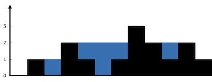

### Hard Problems

1. First Missing Positive
   
    Given an unsorted integer array nums, find the smallest missing positive integer.
    [Solution](../src/com/algorhythm/hard/array/FirstMissingPositive.java)
   
2.  Insert Delete GetRandom O(1) - Duplicates allowed

    Implement the RandomizedCollection class:

    RandomizedCollection() Initializes the RandomizedCollection object. 
    **bool insert(int val):** Inserts an item val into the multiset if not present. Returns true if the item was not present, false otherwise.  
    **bool remove(int val):** Removes an item val from the multiset if present. Returns true if the item was present, false otherwise. Note that if val has multiple occurrences in the multiset, we only remove one of them.  
    **int getRandom():** Returns a random element from the current multiset of elements (it's guaranteed that at least one element exists when this method is called). The probability of each element being returned is linearly related to the number of same values the multiset contains. 
    _You must implement the functions of the class such that each function works in average **O(1)** time complexity._

   

    
 Hint/ Solution Detail 

    
    Refer: https://leetcode.com/problems/insert-delete-getrandom-o1-duplicates-allowed/  
    [Solution](../src/com/algorhythm/hard/array/InsertDeleteGetRandomWithDuplicates.java)
    
   
   
3. Trapping Rain Water
   Given n non-negative integers representing an elevation map where the width of each bar is 1, compute how much water it can trap after raining. 
   

    

    
 Hint/ Solution Detail 

    Refer: https://leetcode.com/problems/trapping-rain-water/  
    [Solution](../src/com/algorhythm/hard/array/TrappingRainWater.java)
    
   
