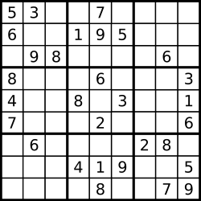
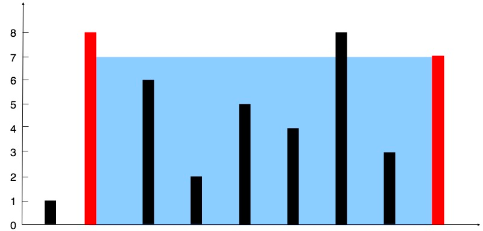
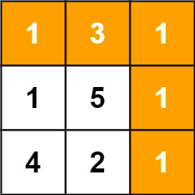

### Medium Problems

1. Find the Duplicate Number

   Given an array of integers nums containing n + 1 integers where each integer is in the range [1, n] inclusive. 
   There is only one repeated number in nums, return this repeated number. 

   

   
 Hint/ Solution Detail 

   Refer: https://leetcode.com/problems/find-the-duplicate-number/  
   [Solution](../src/com/algorhythm/medium/list/FindTheDuplicateNumber.java)
   

2. Delete Leaves With a Given Value

   Given a binary tree root and an integer target, delete all the leaf nodes with value target.  
   Note that once you delete a leaf node with value target, if it's parent node becomes a leaf node and has the value target, it should also be deleted (you need to continue doing that until you can't). 
   
   

   
 Hint/ Solution Detail 

   Refer: https://leetcode.com/problems/delete-leaves-with-a-given-value/  
   [Solution](../src/com/algorhythm/medium/tree/RemoveLeafNode.java)
   

3. Valid Soduku
   Determine if a 9 x 9 Sudoku board is valid. Only the filled cells need to be validated according to the following rules: 
   
   Each row must contain the digits 1-9 without repetition. 
   Each column must contain the digits 1-9 without repetition. 
   Each of the nine 3 x 3 sub-boxes of the grid must contain the digits 1-9 without repetition. 
   
   

   
 Hint/ Solution Detail 

   Refer: https://leetcode.com/problems/valid-sudoku/  
   [Solution](../src/com/algorhythm/medium/matrix/ValidSoduku.java)
   

4. Container With Most Water
   Given n non-negative integers a1, a2, ..., an , where each represents a point at coordinate (i, ai). n vertical lines are drawn such that the two endpoints of the line i is at (i, ai) and (i, 0). Find two lines, which, together with the x-axis forms a container, such that the container contains the most water. 
   Notice that you may not slant the container.
   
   

   
 Hint/ Solution Detail 

   Refer: https://leetcode.com/problems/container-with-most-water/  
   [Solution](../src/com/algorhythm/medium/list/ContainerWithMostWater.java)
   

   
5. Product of Array Except Self
   Given an integer array nums, return an array answer such that answer[i] is equal to the product of all the elements of nums except nums[i].  
   The product of any prefix or suffix of nums is guaranteed to fit in a 32-bit integer. 
   You must write an algorithm that runs in O(n) time and without using the division operation.
   

   
 Hint/ Solution Detail 

   Refer: https://leetcode.com/problems/product-of-array-except-self/  
   [Solution](../src/com/algorhythm/medium/list/ProductOfArrayExceptSelf.java)
   

6. Minimum Path Sum
   Given an m x n grid filled with non-negative numbers, find a path from top left to bottom right, which minimizes the sum of all numbers along its path. 
   
   Note: You can only move either down or right at any point in time.
   
    

   
 Hint/ Solution Detail 

   Refer: https://leetcode.com/problems/minimum-path-sum/  
   [Solution](../src/com/algorhythm/medium/dp/MinimumPathSum.java)
   

7. Jump Game
   Given an array of non-negative integers nums, you are initially positioned at the first index of the array. 
   Each element in the array represents your maximum jump length at that position.  
   Determine if you are able to reach the last index.
    

   
 Hint/ Solution Detail 

   Refer: https://leetcode.com/problems/jump-game/  
   [Solution](../src/com/algorhythm/medium/dp/JumpGame.java)
   

8. #### Subarray Sum Equals K
   Given an array of integers nums and an integer k, return the total number of continuous subarrays whose sum equals to k.  

    

    
 Hint/ Solution Detail 

   Refer: https://leetcode.com/problems/subarray-sum-equals-k/  
   [Solution](../src/com/algorhythm/medium/list/SumSumEqualsK.java)
    
   

9. #### Maximum Product Subarray
   Given an integer array nums, find a contiguous non-empty subarray within the array that has the largest product, and return the product. 
   It is guaranteed that the answer will fit in a 32-bit integer. 
   A subarray is a contiguous subsequence of the array. 
   

   
 Hint/ Solution Detail 

   Refer: https://leetcode.com/problems/maximum-product-subarray/ 
   [Solution](../src/com/algorhythm/medium/dp/MaximumProductSubarray.java)
   
 